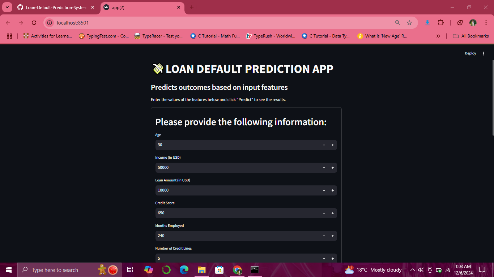

# STREAMLIT WEB APP SCREENSHOT

# 💸Loan-Default-Prediction-System
An interactive web app powered by XGBoost and Streamlit, that predicts the likelihood of loan defaults based on various applicant attributes and historical data. The model predicts loan defaults based on key features like credit score, income, loan amount, and more. Designed for efficient risk assessment and decision-making.

# BACKGROUND
Financial institutions encounter significant challenges in assessing the creditworthiness of loan applicants, a crucial factor for minimizing defaults and managing risk. 

By leveraging these technologies, financial institutions can better analyze a range of applicant data, including spending habits, income patterns, and even social factors, to make more informed lending decisions.

# PROBLEM STATEMENT
Loan defaults pose a significant risk to financial institutions, leading to losses and reduced profitability. Predicting which borrowers are likely to default as accurately as possible based on factors like credit history, income, and loan characteristics can help mitigate this risk

# OBJECTIVES
- To develop strategies and guidelines based on the model’s insights to help financial institutions make informed lending decisions.

- To create a machine learning model that predicts the likelihood of loan defaults based on various applicant attributes and historical data.

# EXPLORATORY DATA ANALYSIS

# MODELING

